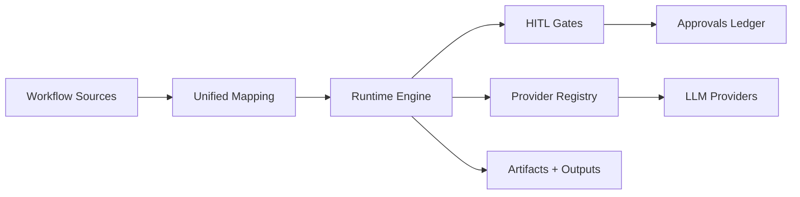

# BQUAT Unified Agentic Framework


Build production-grade agent workflows by unifying BMAD-METHOD, TELIS, and QUINT under one runtime with blocking human-in-the-loop (HITL) gates. BQUAT preserves the original workflows and artifacts while adding enforceable guardrails, runtime approvals, and a reproducible execution model.

## At a glance

- Objective: one operational framework, many workflows, consistent outputs.
- Approach: workflow-to-runtime mapping plus provider and guardrail adapters.
- Control: hard-stop HITL gates with explicit approvals and resumable runs.
- Source of truth: docs/v1-plan.md, methodology/unified_method_specification.md.

## Project status

- Last refreshed: 2025-12-30T23:54:34-05:00 (America/Toronto)
- Primary branch: development
- Release branch: main
- Release target: v1.0 (see docs/v1-plan.md)

## Contents

- What it is
- Architecture at a glance
- Providers
- Workflow and gates
- Quick start
- Quality gates
- CLI
- Docs and registries
- Runtime layout
- Timezone and timestamps
- Change control and branch policy
- Versioning
- Notes

## What it is

BQUAT is a unification layer that keeps BMAD workflow structure intact, applies TELIS context discipline, and embeds QUINT evidence practices. It focuses on deterministic execution, explicit outputs, and auditable approvals without changing the authored intent of existing workflows.

## Architecture at a glance



## Providers

Configured in config/runtime.yaml. The runtime ships with a registry abstraction and provider adapters.

| Provider  | Type      | Default Base URL                                   | Env Key         |
| --------- | --------- | -------------------------------------------------- | --------------- |
| Mock      | mock      | n/a                                                | n/a             |
| Ollama    | ollama    | <http://localhost:11434>                           | n/a             |
| LiteLLM   | litellm   | <http://localhost:4000>                            | API key env var |
| OpenAI    | openai    | <https://api.openai.com>                           | API key env var |
| Anthropic | anthropic | <https://api.anthropic.com>                        | API key env var |
| Gemini    | gemini    | <https://generativelanguage.googleapis.com/v1beta> | API key env var |
| Groq      | groq      | <https://api.groq.com/openai/v1>                   | API key env var |

## Workflow and gates

- Workflows are mapped into runtime steps with explicit outputs and artifact templates.
- HITL gates are policy-based and blocking by default; approval is required to proceed.
- Gate decisions are recorded to `gates.json` alongside approvals for resumable execution.

## Quick start

```bash
uv pip install -r requirements-dev.txt
# or: pip install -r requirements-dev.txt
npm install
npm run prepare
python methodology/tools/generate_mapping.py
python tests/run_tests.py
pytest
```

## Quality gates

```bash
npm run lint
npm run format:check
npm run typecheck
npm test
```

- Lint: Ruff (Python), ESLint JSON (duplicate keys), markdownlint-cli2.
- Format: Ruff formatter for Python and Prettier for Markdown, JSON, YAML.
- Typecheck: mypy and pyright (pre-commit only, not CI).

## CLI

```bash
python -m cli.main validate
python -m cli.main run bmm prd --agent bmad --provider mock
python -m cli.main approve <run-id> --by you
python -m cli.main status <run-id>
python -m cli.main list
python -m cli.main history --limit 5
python -m cli.main export <run-id> --output runs/export.json
```

- If a workflow is outside configured automation phases and `--agent` is provided, the CLI prompts for manual vs automated execution.
- Use `--auto` or `--manual` on `run`/`resume` (with `--agent`) to override the prompt.
- Example overrides:

```bash
python -m cli.main run bmm prd --agent bmad --provider mock --auto
python -m cli.main resume <run-id> --agent bmad --provider mock --manual
```

## Installer (planned)

The full framework will ship through the BMAD installer so slash commands from BMAD, QUINT, and BQUAT are installed together.
Target command: `npx bmad-method@alpha install`.

## Docs and registries

- Unified method specification: methodology/unified_method_specification.md
- v1.0 release plan and checklist: docs/v1-plan.md
- Traceability audit and requirement coverage: docs/traceability-audit.md
- Runtime step contract: docs/runtime-step-contract.md
- Tool execution pipeline: docs/tool-execution-pipeline.md
- Runtime schemas: docs/runtime-schemas.json
- Documentation index: docs/unified-framework-documentation-index.md
- Agent and workflow registries: methodology/registry-agents.md, methodology/registry-workflows.md
- Agent menu bindings: methodology/registry-agent-menus.md
- Workflow to Quint/TELIS mapping: methodology/integration-mapping.md
- Release notes: CHANGELOG.md

## Runtime layout

| Path         | Purpose                           |
| ------------ | --------------------------------- |
| runtime/     | engine, gates, providers, tools   |
| methodology/ | unified spec, registries, mapping |
| config/      | runtime configuration             |
| cli/         | CLI entrypoints                   |
| docs/        | plans, audits, reference docs     |

## Timezone and timestamps

All runtime timestamps use getCurrentTime and default to America/Toronto. Override with `BQUAT_TIMEZONE` if needed.

## Change control and branch policy

Scope changes must be recorded in docs/v1-plan.md with an owner and rationale. The development branch is primary; main is release only.

## Versioning

This repository follows SemVer (see docs/versioning.md). The source of truth is the root VERSION file.

## Notes

- Sample and reference workflows are excluded from production registries and mappings.
- Mapping artifacts only include explicit outputs and templates from workflow definitions.
